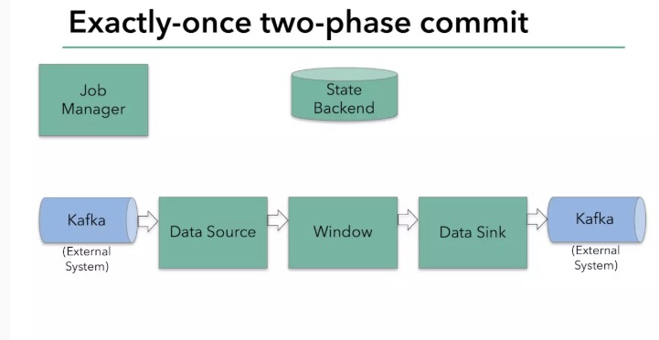

2017年12月，apache flink 1.4.0发布。其中有一个里程碑式的功能：两部提交的sink function（TwoPhaseCommitSinkFunction，relevant Jira here）。TwoPhaseCommitSinkFunction 就是把最后写入存储的逻辑分为两部提交，这样就有可能构建一个从数据源到数据输出的一个端到端的exactly-once语义的flink应用。当然，TwoPhaseCommitSinkFunction的数据输出包括apache kafka 0.11以上的版本。flink提供了一个抽象的TwoPhaseCommitSinkFunction类，来让开发者用更少的代码来实现端到端的exactly-once语义（附上TwoPhaseCommitSinkFunction的文档）。

接下来，我们进一步介绍flink的这个特性：

    flink的checkpoints在保证exactly-once语义是的作用

    flink是如何通过两部提交协议来保证从数据源到数据输出的exactly-once语义

    通过一个例子来解释如果应用TwoPhaseCommitSinkFunction来实现一个exactly-once的sink

##  exactly-once语义就是保证最后的数据处理的结果和数据摄入时没有数据的丢失与重复。
flink的checkpoint包含了，flink应用现在的状态与数据输入流的位置（对于kafka来说就是offset）

checkpoint可异步的持久化到像s3或者hdfs这样子的存储系统里面。如果flink应用失败或者升级时，可以拉取checkpoint中的状态来恢复上次失败时的数据。

在flink1.4.0之前，flink通过checkpoint保证了flink应用内部的exactly-once语义。现在加入了TwoPhaseCommitSinkFunctio可以保证端到端的exactly-once语义。

两次提交来保证语义的方式需要flink所连接的外部系统支持两部提交，也就是外部系统要支持可以预提交和回滚没有最终提交的数据这样子的特性。后面我们会flink是如何与外部系统进行二次提交协议来保证语义的

使用flink来保证端到端的数据不丢失不重复
下面我们来看看flink消费并写入kafka的例子是如何通过两部提交来保证exactly-once语义的。

kafka从0.11开始支持事物操作，若要使用flink端到端exactly-once语义需要flink的sink的kafka是0.11版本以上的。 同时 DELL/EMC的 Pravega 也支持使用flink来保证端到端的exactly-once语义。

这个例子包括以下几个步骤：

- 从kafka读取数据
- 一个聚合窗操作
- 向kafka写入数据

为了保证exactly-once，所有写入kafka的操作必须是事物的。在两次checkpiont之间要批量提交数据，这样在任务失败后就可以将没有提交的数据回滚。

然而一个简单的提交和回滚，对于一个分布式的流式数据处理系统来说是远远不够的。下面我们来看看flink是如何解决这个问题的。（图1）

  

两部提交协议的第一步是预提交。flink的jobmanager会在数据流中插入一个检查点的标记（这个标记可以用来区别这次checkpoint的数据和下次checkpoint的数据）。

这个标记会在整个dag中传递。每个dag中的算子遇到这个标记就会触发这个算子状态的快照。（图2）
  

读取kafka的算子，在遇到检查点标记时会存储kafka的offset。之后，会把这个检查点标记传到下一个算子。（图3）

接下来就到了flink的内存操作算子。这些内部算子就不用考虑两部提交协议了，因为他们的状态会随着flink整体的状态来更新或者回滚。
  

到了和外部系统打交道的时候，就需要两步提交协议来保证数据不丢失不重复了。在预提交这个步骤下，所有向kafka提交的数据都是预提交。（图4）

  

当所有算子的快照完成，也就是这次的checkpoint完成时，flink的jobmanager会向所有算子发通知说这次checkpoint完成，flink负责向kafka写入数据的算子也会正式提交之前写操作的数据。在任务运行中的任何阶段失败，都会从上一次的状态恢复，所有没有正式提交的数据也会回滚。（图5）

  

总结一下flink的两步提交：

        当所有算子都完成他们的快照时，进行正式提交操作

        当任意子任务在预提交阶段失败时，其他任务立即停止，并回滚到上一次成功快照的状态。

        在预提交状态成功后，外部系统需要完美支持正式提交之前的操作。如果有提交失败发生，整个flink应用会进入失败状态并重启，重启后将会继续从上次状态来尝试进行提交操作。

在flink中应用两步提交算子
在使用两步提交算子时，我们可以继承TwoPhaseCommitSinkFunction这个虚拟类。

通过一个简单的写文件的例子来解释一下这个虚拟类。这个两步提交的类有四个状态。

    1. 开始事物（beginTransaction）- 创建一个临时文件夹，来写把数据写入到这个文件夹里面。

    2. 预提交（preCommit）- 将内存中缓存的数据写入文件并关闭。

    3. 正式提交（commit）- 将之前写完的临时文件放入目标目录下。这代表着最终的数据会有一些延迟。

    4. 丢弃（abort）- 丢弃临时文件

若失败发生在预提交成功后，正式提交前。可以根据状态来提交预提交的数据，也可删除预提交的数据。

总结
flink通过状态和两次提交协议来保证了端到端的exactly-once语义。

flink支持Pravega和 kafka 0.11版本之上的 生产者的exactly-once语义的保证